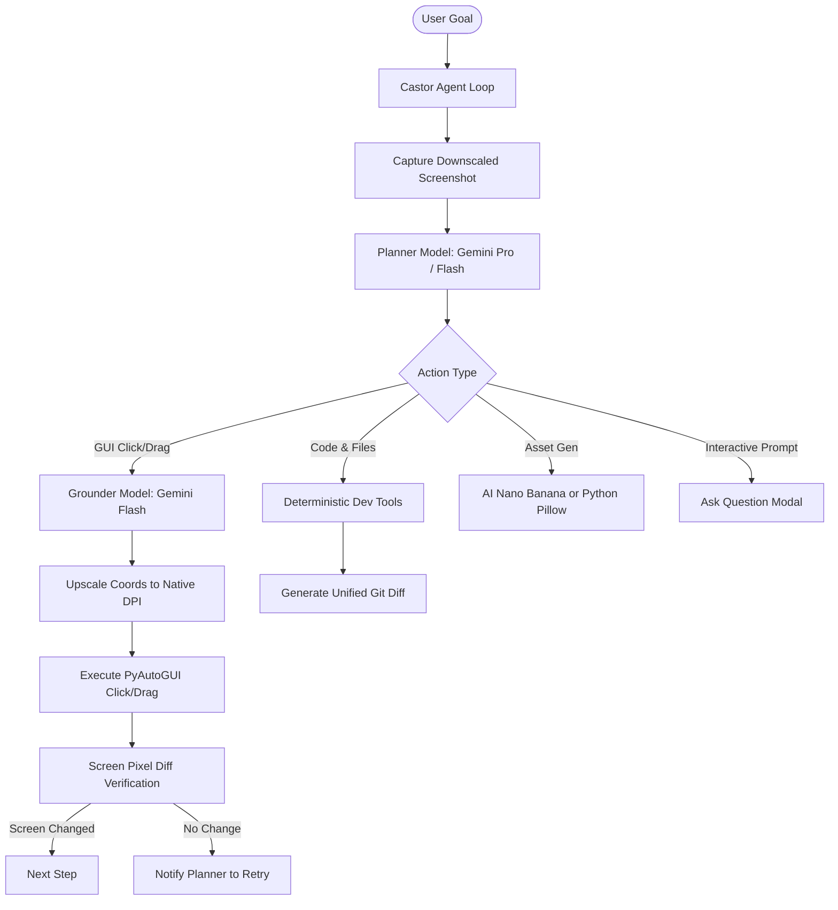

# Castor AI Assistant 🦫

[](https://opensource.org/licenses/MIT)
[](https://ai.google.dev/)
[](https://www.electronjs.org/)

Castor is an autonomous, open-source **Dual-Agent Desktop & Coding Assistant**. It pairs a high-level multimodal reasoning Planner with a precise screen Grounder, combined with a suite of deterministic developer tools, multi-key resilience, living artifacts, and workspace safety checkpoints.

---

## 🌟 Key Capabilities

- **🧠 Dual-Agent Spatial Engine**: Decouples semantic reasoning (`gemini-2.5-pro` or `flash-lite`) from coordinate grounding (`gemini-2.5-flash`), delivering pixel-perfect desktop automation.
- **🛡️ Workspace Safety Checkpoints**: Create zero-risk snapshots and perform instant rollbacks before major refactors, multi-file code modifications, or terminal commands.
- **🎨 Dual-Mode Visual Generation**: Generates application icons, favicons, badges, sprites, and textures using Google Gemini **Nano Banana** AI models with zero-quota fallback to local Python Pillow/SVG.
- **🔄 Multi-Key & Multi-Model Pool**: Infinite quota resilience with automatic key rotation and model cascading on `429 RESOURCE_EXHAUSTED`.
- **📜 Antigravity Living Artifacts**: Real-time sidecar documents (walkthroughs, plans, design specs, diff views) stored in `.castor/artifacts/`.
- **🧪 Universal Test Runner**: Auto-detects and verifies tests across JavaScript/TypeScript (`npm test`), Python (`pytest`/`unittest`), Go (`go test`), Rust (`cargo test`), and .NET (`dotnet test`).
- **❓ Interactive Question Modals (`ask_question`)**: Solicits design clarification or picks technical options via non-blocking UI modals.
- **🧩 Extensible Domain Skills**: Modular YAML/Python skill packs for Unity 2D/3D development, Windows automation, web development, and more.

---

## 📐 Architecture: The Dual-Agent Loop



---

## 🚀 Quick Start

### Prerequisites
- [Node.js](https://nodejs.org/) v18+
- [Python](https://www.python.org/) 3.10+
- Google Gemini API Key from [Google AI Studio](https://aistudio.google.com/)

### 1. Clone & Set Up Backend

```bash
git clone https://github.com/your-username/Castor.git
cd Castor/backend

# Create virtual environment
python -m venv .venv

# Activate virtual environment
# Windows:
.venv\Scripts\activate
# Linux/macOS:
source .venv/bin/activate

# Install dependencies
pip install -r requirements.txt

# Configure your environment
cp .env.example .env
```
Open `backend/.env` and add your `GEMINI_API_KEY`. You can also configure multiple comma-separated keys for auto-failover (`GEMINI_API_KEYS=key1,key2,key3`).

### 2. Set Up Frontend & Run

```bash
cd ../frontend
npm install
npm run dev
```

This starts the Vite web server on `http://localhost:5173` and boots Electron, which automatically connects to the FastAPI backend on port `8000`.

---

## ⚙️ Configuration (.env)

| Variable | Default | Description |
|---|---|---|
| `GEMINI_API_KEY` | *(required)* | Primary Gemini API Key |
| `GEMINI_API_KEYS` | *(optional)* | Comma-separated backup keys for automatic 429 rotation |
| `PLANNER_MODEL` | `gemini-flash-lite-latest` | Model for planning & tool execution |
| `GROUNDER_MODEL` | `gemini-flash-lite-latest` | Model for UI coordinate localization |
| `SCREEN_DIFF_THRESHOLD`| `1.0` | Threshold below which an action is flagged as unchanged |
| `MAX_STEPS` | `30` | Max planner iterations before automatic self-termination |
| `BASH_TIMEOUT` | `60.0` | Timeout in seconds for background terminal commands |

---

## 🛡️ Safety & Failsafes

- **Hardware Kill Switch**: Press `Ctrl+Shift+Esc` anytime to instantly abort agent execution and sever backend communication.
- **PyAutoGUI Failsafe**: Slam the mouse cursor into any corner of the primary screen to immediately halt pointer execution.
- **Human-in-the-Loop (HitL)**: Toggle HitL mode in the UI header to require manual user approval before any file writes, bash commands, or mouse clicks.

---

## 🤝 Contributing

We welcome community contributions! Please review [CONTRIBUTING.md](CONTRIBUTING.md) for local development workflows, code standards, and PR submission guidelines.

---

## 📄 License

This project is licensed under the [MIT License](LICENSE).
